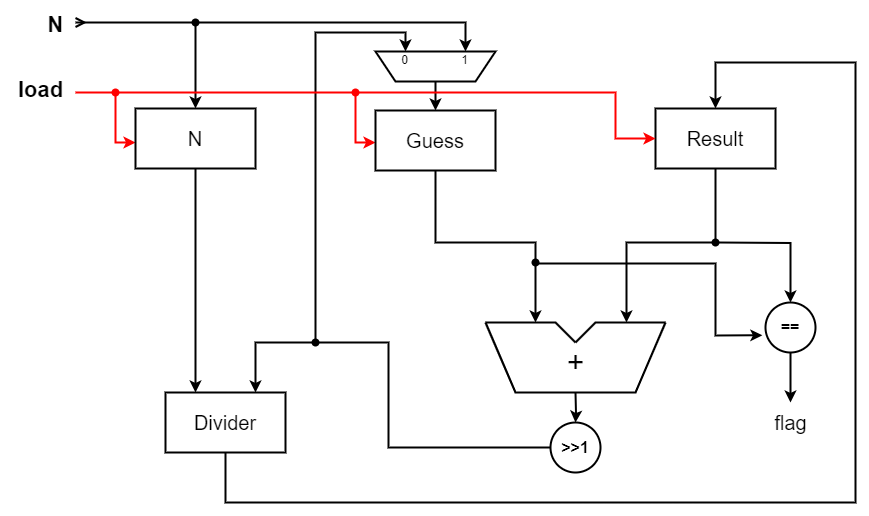

# Square-root-in-Verilog

# Pseudo code for Babylonian method to find the square root

```
1 Start with an arbitrary positive start value x (the closer to the 
   root, the better).
2 Initialize y = 1.
3. Do following until desired approximation is achieved.
  a) Get the next approximation for root using average of x and y
  b) Set y = n/x

```

# Architecture for square root

